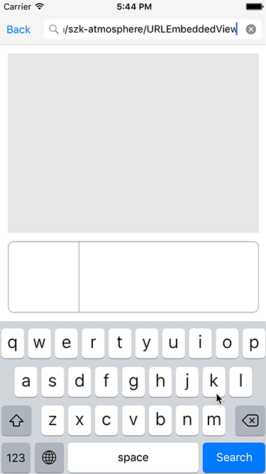
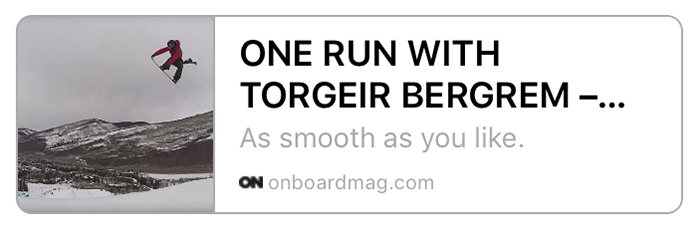
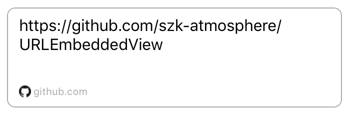
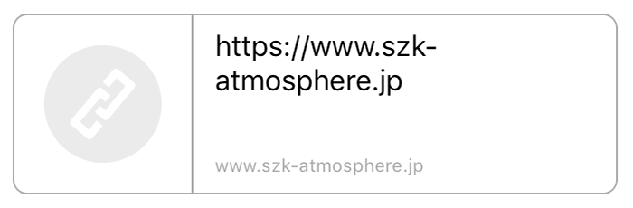

# URLEmbeddedView

[](https://developer.apple.com/iphone/index.action)
[](https://developer.apple.com/swift)
[](http://cocoapods.org/pods/URLEmbeddedView)
[](http://cocoapods.org/pods/URLEmbeddedView)

 


## Features

- [x] Simple interface for fetching Open Graph Data
- [x] Be able to display Open Graph Data
- [x] Automatically caching Open Graph Data
- [x] Automatically caching Open Graph Image
- [x] Tap handleable
- [x] Clearable image cache
- [x] Clearable data cache
- [x] Support Swift2.3
- [x] Support Swift3
- [ ] Configurable expire date for cache

## Usage

To run the example project, clone the repo, and run `pod install` from the Example directory first.

```swift
let embeddedView = URLEmbeddedView()
embeddedView.loadURL(urlString)
```

## Layouts

- Default



- No Image



- No response



## Customization

```swift
embeddedView.textProvider[.Title].font = .boldSystemFontOfSize(18)
embeddedView.textProvider[.Title].fontColor = .lightGrayColor()
embeddedView.textProvider[.Title].numberOfLines = 2
//You can use ".Title", ".Description", ".Domain" and ".NoDataTitle"
```

## Data and Image Cache

You can get Open Graph Data with `OGDataProvider`.

```swift
OGDataProvider.shared.fetchOGData(urlString: String, completion: ((OGData, Error?) -> Void)? = nil) -> NSURLSessionDataTask?
OGDataProvider.shared.deleteOGData(urlString: String, completion: ((Error?) -> Void)? = nil)
OGDataProvider.shared.deleteOGData(ogData: OGData, completion: ((Error?) -> Void)? = nil)
```

You can configure time interval for next updating of OGData.
Default is 10 days.

```swift
OGDataProvider.shared.updateInterval = 10.days
```

You can get UIImage with `OGImageProvider`.

```swift
OGImageProvider.shared.loadImage(urlString: String, completion: ((UIImage?, Error?) -> Void)? = nil) -> NSURLSessionDataTask?
OGImageProvider.shared.clearMemoryCache()
OGImageProvider.shared.clearAllCache()
```

## OGData Properties

```swift
@NSManaged public var createDate: NSDate
@NSManaged public var imageUrl: String
@NSManaged public var pageDescription: String
@NSManaged public var pageTitle: String
@NSManaged public var pageType: String
@NSManaged public var siteName: String
@NSManaged public var sourceUrl: String
@NSManaged public var updateDate: NSDate
@NSManaged public var url: String
```

## Installation

URLEmbeddedView is available through [CocoaPods](http://cocoapods.org). To install
it, simply add the following line to your Podfile:

```ruby
# Uncomment the next line to define a global platform for your project
# platform :ios, '8.0'

target 'Your Project Name' do
  # Comment the next line if you're not using Swift and don't want to use dynamic frameworks
  use_frameworks!

  # Pods for URLEmbeddedViewSample
  pod "URLEmbeddedView"
end
```

## Use in Objective-C

```objective-c
#import <URLEmbeddedView/URLEmbeddedView-Swift.h>

- (void)viewDidLoad {
    [super viewDidLoad];
    URLEmbeddedView *embeddedView = [[URLEmbeddedView alloc] init];
    [self.view addSubView:embeddedView];
    [embeddedView loadURL:@"https://github.com/" completion:nil];
}

- (void)setUpdateInterval {
  [OGDataProvider sharedInstance].updateInterval = [NSNumber days:10];
}
```

[Here](./Example/URLEmbeddedViewSample/OGObjcSampleViewController.m) is Objective-C sample.

## Special Thanks

- [Kanna(鉋)](https://github.com/tid-kijyun/Kanna) is a great XML/HTML parser for Mac OS X and iOS. (Created by [@tid-kijyun](https://github.com/tid-kijyun))
- [CryptoSwift](https://github.com/krzyzanowskim/CryptoSwift) is a greate Crypto related functions and helpers for Swift. (Created by [@krzyzanowskim](https://github.com/krzyzanowskim))

## Requirements

- Xcode 8.0 or greater
- iOS 8.0 or greater
- [Kanna(鉋)](https://github.com/tid-kijyun/Kanna)
- UIKit
- CoreData
- CoreGraphics

## Other

- [MisterFusion](https://github.com/szk-atmosphere/MisterFusion) - Swift DSL for AutoLayout
- [NoticeObserveKit](https://github.com/marty-suzuki/NoticeObserveKit) (type-safe NotificationCenter wrapper) is used in this sample.
- Android version is [here](https://github.com/kaelaela/OpenGraphView). (Created by [@kaelaela](https://github.com/kaelaela))

## Author

Taiki Suzuki, s1180183@gmail.com

## License

URLEmbeddedView is available under the MIT license. See the LICENSE file for more info.
