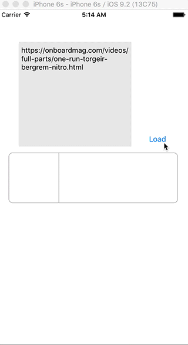

# URLEmbeddedView

[](https://developer.apple.com/iphone/index.action)
[](https://developer.apple.com/swift)
[](http://cocoapods.org/pods/URLEmbeddedView)
[](http://cocoapods.org/pods/URLEmbeddedView)



## Features

- [x] Simple interface for fetching Open Graph Data
- [x] Be able to display Open Graph Data
- [x] Automatically caching Open Graph Data
- [x] Automatically caching Open Graph Image
- [x] Tap handleable
- [x] Clearable image cache
- [x] Clearable data cache

## Usage

To run the example project, clone the repo, and run `pod install` from the Example directory first.

```swift
let embeddedView = URLEmbeddedView()
embeddedView.loadURL(urlString)
```

## Layouts

- Default


- No Image


- No response


## Customization

```swift
embeddedView.textProvider[.Title].font = .boldSystemFontOfSize(18)
embeddedView.textProvider[.Title].fontColor = .lightGrayColor()
embeddedView.textProvider[.Title].numberOfLines = 2
```

## Data and Image Cache

You can get Open Graph Data with `OGDataProvider`.

```swift
OGDataProvider.sharedInstance.fetchOGData(url: String, completion: ((OGData, NSError?) -> Void)? = nil) -> NSURLSessionDataTask?
```

You can get UIImage with `OGImageProvider`.

```swift
OGImageProvider.sharedInstance.loadImage(url: String, uuidString: String, completion: ((UIImage?, String, NSError?) -> Void)? = nil) -> NSURLSessionDataTask?
OGImageProvider.sharedInstance.clearMemoryCache()
OGImageProvider.sharedInstance.clearAllCache()
```

## Installation

URLEmbeddedView is available through [CocoaPods](http://cocoapods.org). To install
it, simply add the following line to your Podfile:

```ruby
pod "URLEmbeddedView"
```

## Special Thanks

[Kanna(鉋)](https://github.com/tid-kijyun/Kanna) is an great XML/HTML parser for Mac OS X and iOS. (Created by @tid-kijyun)

## Requirements

- Xcode 7.0 or greater
- iOS 8.0 or greater
- [MisterFusion](https://github.com/szk-atmosphere/MisterFusion) - Swift DSL for AutoLayout
- UIKit
- CoreData
- CoreGraphics

## Author

Taiki Suzuki, s1180183@gmail.com

## License

URLEmbeddedView is available under the MIT license. See the LICENSE file for more info.
